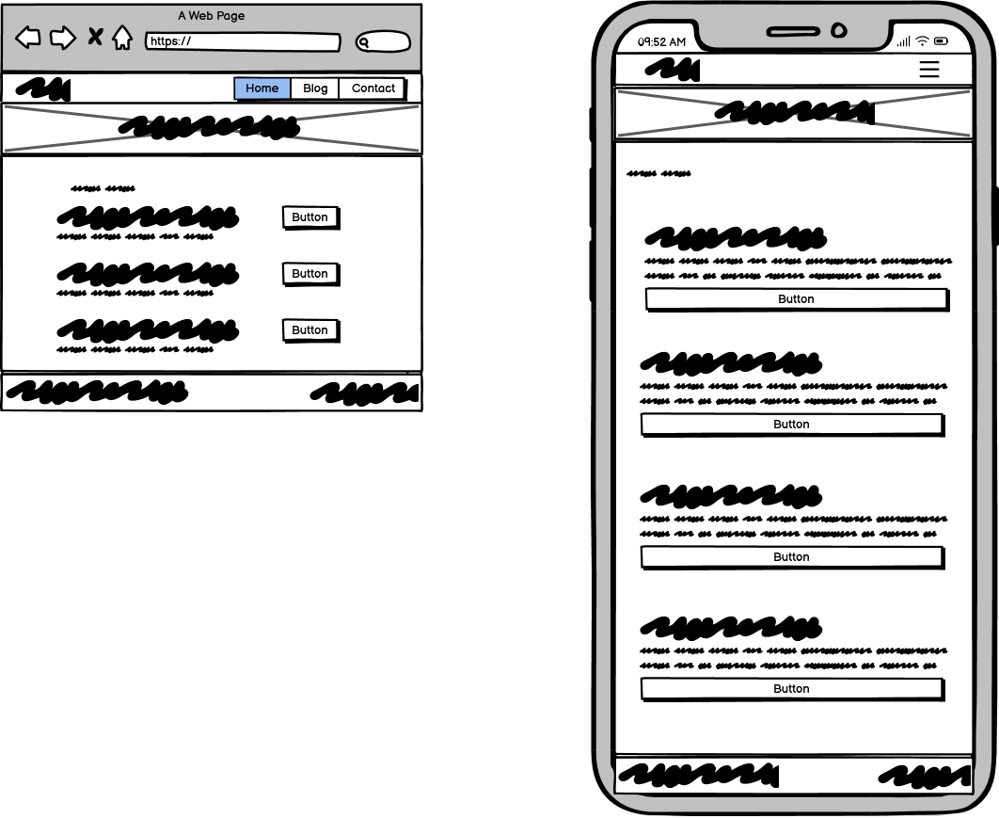

# CI/Scoop

CI/Scoop was developed as for me as a developer to share my thoughts, opinions and projects. Users are able to register an account and send messages to me using the form on the contact page. As an admin of the site I am able to Create, Edit and Delete blog posts. The website employs a feature rich content editor for use with writing blog posts allowing the use of font sizing, italics, bold fonts, lists, externally hosted images etc.


View the website [here](https://ciscoop-46d70b5281a0.herokuapp.com/).

# Project Overview

CI/Scoop is blogging website built using **Python**, **Flask**, **SQLAlchemy**, **Bootstrap 5**, and **JavaScript**.

- User authentication and CRUD functionality is handled by a relational backend database (**PostgreSQL**)

CI/Scoop is my submission for the Milestone 3 Project by Code Institute in partnership with East Kent College for the Level 5 Diploma in Full Stack Web Application Development.

The choice to make this project was influenced by my need for a blogging platform to highlight my projects and knowledge in full stack web application by creating a portfolio website, thereby the website itself is a demenstration of my abilities.

# README Contents

<details>
<summary>Table of Contents </summary>

- [Project Overview](#project-overview)
- [UX Development](#ux-development)
  - [Strategy](#strategy)
    - [Project Goals](#project-goals)
    - [User Demographic](#user-demographic)
    - [User Stories](#user-stories)
    - [Scope](#scope)
- [Structure](#structure)
  - [Topology](#topology-diagrams)
  - [Database Schema](#database-schema--structure)
- [Skeleton](#skeleton)
  - [Wireframes](#wireframes)
  - [Colour Schemes](#colour-scheme)
  - [Typography](#typography)
  - [Imagery](#imagery)
- [Features](#features)
  - [Multi-Page Elements](#multipage-elements)
  - [CRUD Table](#crud-table)
  - [Defensive Programming](#defensive-programming)
  - [Error Handling](#error-handling)
- [technologies Used](#technologies-used)
- [Future Implementation](#future-implementation)
- [Testing](#testing)
  - [Bugs, Issues and Solutions](#bugs-issues-and-solutions)
- [Deployment and Local Development](#deployment-and-local-development)
  - [Deployment](#deployment-to-heroku)
  - [Cloning](#cloning-the-repo)
  - [Forking](#forking-the-repo)
  - [VENV Help](#create-virtual-environment)
  - [Database Help](#create-and-migrate-database)
- [Credits](#credits)
  - [Content](#content)
  - [Media](#media)
  - [Acknowledgements](#acknowledgements)

</details>

# UX Development

## Strategy

### Project Goals

- Develop a full stack website
- Website needs to include full CRUD functionality
- Guests will be able to view and navigate public sections of the website
- Guests will be able to send a message to the admins using the form on the contact page
- Admins will be able to create, edit and delete blog posts
- Admins will be able to read and delete messages sent by the contact form
- Present information in an easy to read manner
- Implement responsive design methodologies
- Provide the option for users to create an account and login/logout
- Provide registered Admin users CRUD functionality in appropriate sections of the website
- Implement defensive programming to prevent accidental deletion of data
- Handle errors to aid the users in understanding the cause of the issue and getting them back on track

### User Demographic

- Anyone interested in technology or software development
- Anyone interested in my progress as a full stack developer
- potential employers

### User Stories

#### First Time Visitor Goals

As a first time visitor I want to be able to:

- Immediately understand the purpose of the website
- Immediately recognise how to use and navigate the website
- Browse the articles available
- Register for an account

#### Registered/Returning Visitor Goals

As a registered or returning visitor I want to be able to:

- Easily find new content
- Send a message to the site owner/admin
- Browse new blog posts

#### Site Admin Goals

As a site admin I want to be able to:

- Be able to add a new blog post
- Be able to edit exisiting blog posts
- Be able to delete exisiting blog posts
- View messages sent via the contact form
- Delete messages sent via the contact form

### Scope

#### Functionality Planning

When planning the scope of the project I created a Viability Analysis of the features I wished to add. This would allow me to prioritise the most critical features and defer the development of lesser functionality to a later date. Below is that table:

| #   | Feature                                | Importance | Viability |
| --- | -------------------------------------- | ---------- | --------- |
| 1   | View, Create, Edit & Delete Blog Posts | 5          | 5         |
| 2   | Registration Functionality             | 5          | 5         |
| 3   | Login/Logout Functionality             | 5          | 5         |
| 4   | Contact Form                           | 5          | 5         |
| 5   | Read/Delete Contact Form Submissions   | 5          | 5         |
| 6   | Blog Commenting Functionality          | 2          | 5         |
| 7   | Display Suggested Articles             | 1          | 2         |
| 8   | Share Blog Posts on Social Media       | 2          | 4         |
| 9   | Log User Activity                      | 2          | 2         |
| 10  | User Profile Page Functionality        | 2          | 5         |
| 11  | Search for Blog Posts                  | 1          | 4         |
| 12  | User Action Validation                 | 5          | 5         |

Based on the premise of creating a minimally viable product I have decided to focus on implementing only the core functionality for the application to meet the minimum required specifications for functionality. This means on the initial development sprint I will be implementing features 1, 2, 3, 4, 5 and 12.

#### Functionality Requirements

- Clean and thematically cohesive design
- Functional and aesthetic presentation of blog posts
- Login/logout functionality
- Full CRUD functionality
- Defensive programming usage to safeguard the database from malicious or erroneous input
- Appropriate handling of error messages

# Structure

## Topology Diagrams

Below are diagrams illustrating the pages that are accessible for users based on their session state (guest/logged in guest/admin), any page not listed in a diagram is designed not to be accessible by a user.

- Guest:


- Logged In User:


- Admin:


## Database Schema & Structure

The CI/Scoop website runs from a single database with multiple tables. One table for the management of users, a table for blog posts and another table for messages.

Only users with admin privileges can modify or delete any data. The diagram below (ERD) shows the relationships between these tables.


# Skeleton

## Wireframes

- Homepage


- Blog Page



- Contact Page


- Example Article Page


## Colour Scheme


For the colour palette design I decided to focus on 3 colours shown above for the primary design.

## Typography

I have decided to stick with only one imported font (Roboto, supplied by Google Fonts). I will use this for emphasis on headings and interactive elements in order to direct the users focus to key areas of the page. I decided to use default system fonts elsewhere on the page in order to improve performance.

## Imagery

For various photos around the site I have deicded to use some of my own photos and stock imagery supplied for free by [Unsplash](https://unsplash.com/).

# Features

A breakdown of the various elements and their implementation across the website.

## Multipage Elements

**Navbar**

- Logo
- Navigational Links

**Footer**

- Contact Information

**Home Page**

- Hero
- About Section
- What I do section with Hover effects
- Latest Blogs with links to specific post
- Experience

**Blog**

- Chronologically sorted Blog Posts
- Pagination

**Contact**

- Form to send Admin/Owner a message
- Form will autofill where possible using information from user session

**Admin Dashboard**

- Ability to create posts using a feature rich text editor
- Ability to edit posts using a feature rich text editor
- Ability to Delete posts
- Ability to View Messages
- Ability to Delete Messages

## CRUD Table

Below is a table of CRUD functionality for each relevant page:

| Page            | C                 | R                                         | U                               | D                 |
| --------------- | ----------------- | ----------------------------------------- | ------------------------------- | ----------------- |
| Home            |                   | Fetch 3 latest blog posts                 |                                 |                   |
| Blog            |                   | Fetch paginated blog posts                |                                 |                   |
| Contact         | Submit Message    |                                           |                                 |                   |
| Admin           | Create Blog Posts |                                           |                                 |                   |
| Edit Post       |                   |                                           | Edit specific blog post content |                   |
| Blog Management |                   |                                           |                                 | Delete Blog Posts |
| View Messages   |                   | Read messages submitted from contact page |                                 | Delete Messages   |
| Login           |                   | Check password hash                       |                                 |                   |
| Register        | User profile      |                                           |                                 |                   |

## Defensive Programming

Defensive programming has been a core concept driving the development of this webiste and its functionality from the beginning. In order to make a reasonable attempt at securing the website I have implemented the following:

- Privileged pages check the user role and session before rendering and redirect the user if criteria for the page isn't met.

## Error Handling

I have implemented the following handlers in order to catch and gracefully redirect the user where necassary:

- 400: Bad request error
- 404: Not found error
- 408: Request Timeout Error
- 500: Internal Server Error

# Technologies Used

- Languages:

  - HTML5: HTML was used for the page structure
  - CSS3: Used for styling the website
  - JavaScript: was used sparingly where necassary for additional functionality
  - Python: For handling server side logic of the website

- [Flask](https://flask.palletsprojects.com/en/3.0.x/)
  - Flask is a Python based micro web framework
- [Flask Migrate](https://flask-migrate.readthedocs.io/en/latest/)
  - Flask Migrate is a tool for handling SQLAlchemy database migrations using Alembic
- [PostgreSQL](https://www.postgresql.org/)
  - A powerful and open source object-relational database system
- [SQLAlchemy](https://www.sqlalchemy.org/)
  - A Python SQL toolkit and ORM (Object Relational Mapper)
- [pip](https://pypi.org/project/pip/)
  - A package installer for Python
- [Werkzeug](https://werkzeug.palletsprojects.com/en/3.0.x/)
  - A WSGI web application library
- [Jinja](https://jinja.palletsprojects.com/en/3.1.x/)
  - A templating engine
- [CKEditor](https://ckeditor.com/)
  - An integratable rich text editor
- [Balsamiq](https://balsamiq.com/)
  - An appllication for creating wireframe templates
- [Git](https://git-scm.com/)
  - A version control system
- [Bootstrap 5](https://getbootstrap.com/)
  - A front end templating library
- [Heroku](https://dashboard.heroku.com)
  - A cloud platform for hostign websites and applications
- [CloudConvert](https://cloudconvert.com/)
  - A media conversion tool
- [Flowbite](https://flowbite.com/icons/)
  - An online collection of Icon SVG's

# Future Implementation

- Expanding the user profile by allowing the user to add and edit their profile information such as first name, last name, sate of birth etc.
- Allow registered users to delete their own accounts
- Allowing the uploading of images
- Allow user comments on blog posts
- Provide a user interface for the moderating of ragistered users

# Testing

Comprehensive testing documentation can be found in the [testing document](TESTING.md).

## Bugs, Issues and Solutions

- I am a big proponent of autofilling data to improve the user experience wherever possible, therefore when I created the contact form I wanted to autofill it with any appropriate information from the user profile when they were logged in. To this end when I rendered the contact page in my `routes.py` file I was passing a user_email variable to the template. It wasn't until much later on when I was testing that I found this caused an issue when there was no active session. In this case the page was unable to render with the error message <br> `UnboundLocalError: cannot access local variable 'user_email' where it is not associated with a value`.<br> In this case the variable was undefined and caused the issue.

  - In order to resolve the issue I added an else statement wherein I defined the variable as an empty string if the current user was not logged in.

- The W3c Validator detected a stray end div tag within the homepage of the website:

  

  This appeared to be from the message flashing function of Flask of my base template, the function was nested inside of section and then a div.
    - I have moved the `if messages` logic to outside of the div and section in order to resolve this issue.

- W3C Markup validator also detected an issue where a section lacked a heading tag on the Contact page for the form. I believe in this case a heading is not required and so I have option to remove the section element as the form was already a child of a wrapping div which invoked the necassary styling.
  - `Section lacks heading. Consider using h2-h6 elements to add identifying headings to all sections, or else use a div element instead for any cases where no heading is needed.`

- The Admin panel has functionality to delete and edit posts. However, when you delete a post, I used JavaScript to display a confirmation dialogue before deleting the record. A bug in the JS code meant that this dialogue box only worked for the first found instance of the attribute.
  - I have updated this code to iterate through all the found instances of `delete-button` and provide the functionality individually to each:

Before:

```

const deleteConfirm = document.getElementsByClassName('delete-button')[0];
deleteConfirm.addEventListener('click', function () {
  const deleteBtn = this.parentNode.querySelector('.delete-confirm');
  deleteBtn.classList.toggle('hide');
});

```

After:

```

const deleteConfirm = document.getElementsByClassName('delete-button');
// for each element
for (let i = 0; i < deleteConfirm.length; i++) {
  deleteConfirm[i].addEventListener('click', function () {
    const deleteBtn = this.parentNode.querySelector('.btn');
    deleteBtn.parentNode.querySelector('.delete-confirm').classList.toggle('hide');
  });
}

```

- During testing a friend encountered an error page while exploring the site. He stated his steps to receiving the error as follows:
  - Leave a comment on an article
  - View the profile page
  - Navigate to the contact page
The error message he receieved is as below:

This error is produced because of insufficient defensive programming resulting in the attempted concatenation of an unassigned variable.
  - In order to resolve any further instances of this error I added a check to see if a first and last name were available for the user session before, if not the variable would be assigned `None` rather than being left empty.
```

if user.first_name and user.last_name:
    full_name = user.first_name + " " + user.last_name
else:
    full_name = None

```
# Deployment and Local Development

## Deployment to Heroku

The project is deployed to Heroku from this repository, therefore the deployed version of the site is always up to date with this repository and the deployed code is the exact code as in this repository.

In order to clone this project follow the steps below (May vary depending on your development environment):

- Create a local Clone of this repository from GitHub
- Run `pip install -r requirements.txt`
- Log in to Heroku and create a new app and name it as required
- Choose your closest region for deployment
- Still in Heroku, navigate to deploy and select GithHub, then select your cloned repository and click "connect".
- Navigate to the Settings tab and set up your environment variables using the [env.py.example](env.py.example) for reference
- Then return to the Deploy section of the App in Heroku and enable automatic deploys.
- Click on the "Deploy Branch" option.
- It will take a few minutes to deploy, then you can click on "Open App" once it is complete.

## Cloning the Repo

In order to fork the repo, follow these steps:

- Locate the repository
- Click the button labelled "Code" to the top right of the screen
- Click HTTPS and copy the link provided
- In your local environment navigate to the desired directory
- Open a terminal and type "git clone repository-url"
- Press enter to begin the cloning process

## Forking the Repo

- Locate the repository on GitHub
- Click Fork in the top right corner
- If necassary, select the owner for the forked code under the Owner dropdown menu.
- Optionally, edit the Repository Name field to rename your forked repository
- Optionally, use the Description field to input a description of your fork
- Select "Copy the DEFAULT branch only"
  - This is another optional step, many scenarios only require a fork of the default branch. If you do not select this you will copy all branches into your fork
- Click Create Fork

## Create Virtual environment

To create a virtual environment for the project open gitbash or CLI of your choice within the project directory. To do this follow the instructions below:

- Open the CLI in the project directory
- Type `python -m venv /virt`

Then to run the virtual environment type:

- `.\\virt\Scripts\Activate`

This process varies depending on your local development environment and operating system. If the above doesn't work you may need to search for instructions specific to your development environment. Please ensure you have Python installed.

## Create and migrate Database

To create the database enter the CLI and type:

- `psql` and log in with your admin credentials
  - You may need to change username with `psql -U "username"`
  - It will then ask for a password for that username
- `CREATE DATABASE database_name;`

In order to run the migrations you will need to then type the following:

- `$ python`
- `>>> from ciscoop import app, db`
- `>>> app.app_context().push()`
- `>>> db.create_all()`

If you need to set the Flask app environment variable simply run the command:

- `$env:FLASK_APP="app.py"`

# Credits

## Content

Blog article content was generated by using [ChatGPT](https://openai.com/index/chatgpt/)

## Media

Images used on the website were sourced either from my own photos or from [Unsplash](https://unsplash.com/)

## Acknowledgements

Thanks again to my Mentor, Brian Macharia, for provided continuous feedback on my ideas and progress as well as the teams at Code Institute and East Kent College for their ongoing support.
