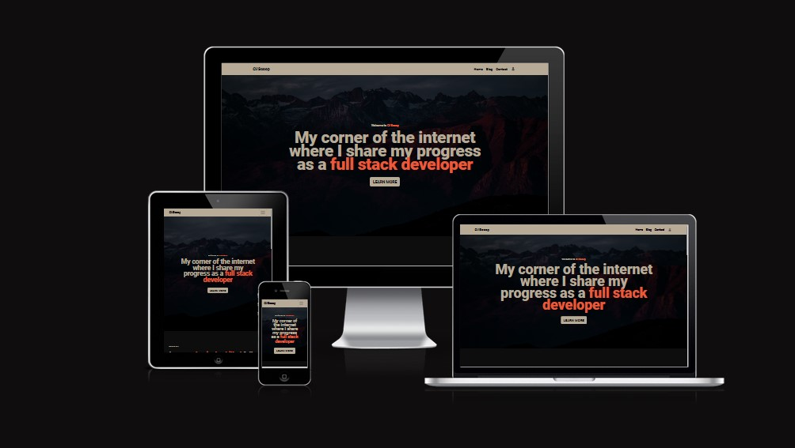

# Testing Documentation

# Validation Results

## W3C Markup Validator Results

- [Homepage](https://validator.w3.org/nu/?doc=https%3A%2F%2Fciscoop-46d70b5281a0.herokuapp.com%2F)
- [Blog Page](https://validator.w3.org/nu/?doc=https%3A%2F%2Fciscoop-46d70b5281a0.herokuapp.com%2Fblog)
- [Article Page](https://validator.w3.org/nu/?doc=https%3A%2F%2Fciscoop-46d70b5281a0.herokuapp.com%2Fblog%2Fthe-future-of-software-development)
- [Contact Page](https://validator.w3.org/nu/?doc=https%3A%2F%2Fciscoop-46d70b5281a0.herokuapp.com%2Fcontact)
- [Login Page](https://validator.w3.org/nu/?doc=https%3A%2F%2Fciscoop-46d70b5281a0.herokuapp.com%2Flogin)
- [Register Page](https://validator.w3.org/nu/?doc=https%3A%2F%2Fciscoop-46d70b5281a0.herokuapp.com%2Fregister)

## W3c CSS Validator

- [CSS Validation results](https://jigsaw.w3.org/css-validator/validator?uri=https%3A%2F%2Fciscoop-46d70b5281a0.herokuapp.com%2Findex&profile=css3svg&usermedium=all&warning=1&vextwarning=&lang=en)

As seen by the results, I have no errors in my CSS, although I do have warnings for the case of CSS Variables not being checked. The warning about CSS Variables is the overwhelming majority of the warnings with several others being for vendor prefixes. Additionally, these errors are coming from the Bootstrap 5 stylsheets which I have no direct control over.

## JSHint Results

My Javascript file is particularly small but for the sake of completeness I have included a JSHint testing of the file. The results of which are below.

## PEP8 Validation

## Lighthouse Results

- [Home - Mobile](documentation/lighthouse-results/home-mobile.png)
- [Home - Desktop](documentation/lighthouse-results/home-desktop.png)
- [Blog - Mobile](documentation/lighthouse-results/blog-mobile.png)
- [Blog - Desktop](documentation/lighthouse-results/blog-desktop.png)
- [Article - Mobile](documentation/lighthouse-results/article-mobile.png)
- [Article - Desktop](documentation/lighthouse-results/article-desktop.png)
- [Contact - Mobile](documentation/lighthouse-results/contact-mobile.png)
- [Contact - Desktop](documentation/lighthouse-results/contact-desktop.png)

## a11y Contrast Test Results

The a11y Contrast Test results displayed one issue which I believe is a false positive, as it is showing black text on a black background for the text "FRONTEND" which I believe to be the section shown in the picture below.

As you can see the text is actually white. It has a hover state where the background is red and the text is black so I believe the automated testing has somehow gotten confused so i will be ignoring this error.

## Wave Test Results

# Responsiveness

## Responsive Design Testing

- [Home - Desktop](documentation/responsiveness/home-desktop.png)
- [Home - Notepad](documentation/responsiveness/home-tablet.png)
- [Home - Mobile](documentation/responsiveness/home-mobile.png)

- [Blog - Desktop](documentation/responsiveness/blog-desktop.png)
- [Blog - Notepad](documentation/responsiveness/blog-tablet.png)
- [Blog - Mobile](documentation/responsiveness/blog-mobile.png)

- [Contact - Desktop](documentation/responsiveness/contact-desktop.png)
- [Contact - Notepad](documentation/responsiveness/contact-tablet.png)
- [Contact - Mobile](documentation/responsiveness/contact-mobile.png)

- [Register - Desktop](documentation/responsiveness/register-desktop.png)
- [Register - Notepad](documentation/responsiveness/register-tablet.png)
- [Register - Mobile](documentation/responsiveness/register-mobile.png)

- [Login - Desktop](documentation/responsiveness/login-desktop.png)
- [Login - Notepad](documentation/responsiveness/login-tablet.png)
- [Login - Mobile](documentation/responsiveness/login-mobile.png)

# Manual testing

| Test                | Goal                                                                                          | Result |
| ------------------- | --------------------------------------------------------------------------------------------- | ------ |
| Responsiveness      | Website to be responsive across all screen sizes                                              | Pass   |
| Flash Messages      | Flash messages give feedback to user when actions like Logging in are undertaken              | Pass   |
| Nav Links           | All navigational links direct user to appropriate pages without any errors                    | Pass   |
| Article Creation    | Admin Users can create Blog Posts without errors                                              | Pass   |
| Edit Articles       | Admin can edit articles without errors                                                        | Pass   |
| Delete Articles     | Admin can delete articles without errors                                                      | Pass   |
| Priviledged access  | Users without permissions get redirected from priviledged pages                               | Pass   |
| Form Submission     | A user of any state should be able to successfully submit the form on the contact page        | Pass   |
| Read Messages       | An Admin user should be able to access and delete all messages submitted via the contact Form | Pass   |
| Delete Messages     | An Admin User should be able to Delete Messages submitted via the Contact Form                | Pass   |
| Login               | A registered User should be able to log in using the correct credentials                      | Pass   |
| Logout              | A logged in user should be able to log out successfully                                       | Pass   |
| Register            | A guest should be able to register an account on the register page                            | Pass   |
| Navbar links update | the Nav Menu links should update based on the state of the user session                       | Pass   |

# User Story testing

## First Time Visitor Goals

- Immediately understand the purpose of the website
  - The user is greeted by a hero banner upon loading the homepage that explains the purpose of the site:
    
- Immediately recognise how to use and navigate the website
  - The sites naviagational menu is pinned to the top of the browser window, ensuring the user always has access to it and is always visible.
    
- Browse the articles available
  - The articles are displayed on the homepage should the user scroll down slightly and a navigational item is also available in the navbar to direct the user to the dedicated blog page.
    
- Register for an account
  - A link to the register page can be found in the navigational menu.
    

## Registered/Returning Visitor Goals

As a registered or returning visitor I want to be able to:

- Easily find new content
  - The front page of the website displays the 3 latest blog posts and updates automatically when a new post is committed to the database.
    
- Send a message to the site owner/admin
  - The contact page allows users to send messages that can be read by site Admins.
    
- Browse new blog posts
  - The blog page is sorted chronologically always showing the newest post to the user.
    

## Site Admin Goals

As a site admin I want to be able to:

- Be able to add a new blog post
  - This can be done directly from the admin page.
    
- Be able to edit exisiting blog posts
  - The functionality to do this can be found in the users admin panel
    
- Be able to delete exisiting blog posts
  - The ability to delete posts can befound in the users admin area page
    
- View messages sent via the contact form
  - The admin area allows admin users this ability
    
- Delete messages sent via the contact form
  - The functionality to do this is, again, available in the admin area.
    
